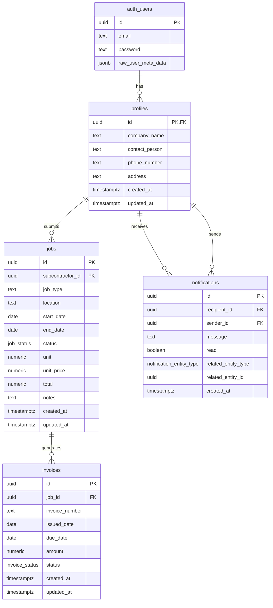

# SQL Schema Analysis for Subcontractor Work Management System

## Overview

This document provides an analysis of the SQL schema in `sql-setup.md` against the requirements specified in `prompt.md` for the Subcontractor Work Management System. The analysis covers:

1. Tables, relationships, and constraints
2. Row Level Security (RLS) policies
3. Triggers and functions
4. Admin user creation process
5. Recommendations for adding the Files table

## Database Schema Diagram



## 1. Tables, Relationships, and Constraints Analysis

### Required Tables

| Table | Status | Notes |
|-------|--------|-------|
| Profiles | ✅ Present | Properly linked to auth.users |
| Jobs | ✅ Present | Contains all required fields |
| Invoices | ✅ Present | Properly linked to jobs |
| Notifications | ✅ Present | Includes read/unread status |
| Files | ❌ Missing | Optional table not implemented |

### Relationships and Constraints

- ✅ **Foreign Key Relationships**: All tables have proper foreign key relationships
- ✅ **Cascade Rules**: ON DELETE CASCADE is properly implemented where needed
- ✅ **Primary Keys**: All tables have UUID primary keys
- ✅ **Not Null Constraints**: Applied to required fields
- ✅ **Default Values**: Appropriate default values are set
- ✅ **Custom Types**: Proper ENUM types for job_status, invoice_status, and notification_entity_type

### Data Types

- ✅ **UUID**: Used for IDs and references
- ✅ **TEXT**: Used for string fields
- ✅ **DATE**: Used for date fields
- ✅ **NUMERIC**: Used for numerical values including monetary amounts
- ✅ **BOOLEAN**: Used for boolean flags
- ✅ **TIMESTAMPTZ**: Used for timestamps with timezone

## 2. Row Level Security (RLS) Policies

### RLS Enablement

- ✅ RLS is enabled on all tables: profiles, jobs, invoices, and notifications

### Profiles Table Policies

- ✅ Users can view their own profile
- ✅ Users can update their own profile
- ✅ Admins can view all profiles
- ❌ Missing: Admins can update all profiles

### Jobs Table Policies

- ✅ Subcontractors can view their own jobs
- ✅ Subcontractors can insert their own jobs
- ✅ Subcontractors can update their pending jobs
- ✅ Admins can view all jobs
- ✅ Admins can update any job
- ❌ Missing: Policy for deleting jobs

### Invoices Table Policies

- ✅ Subcontractors can view their own invoices
- ✅ Admins can manage all invoices (ALL permission covers SELECT, INSERT, UPDATE, DELETE)

### Notifications Table Policies

- ✅ Users can view their own notifications
- ✅ Users can update their own notifications
- ✅ Admins can insert notifications
- ❌ Missing: Policy for admins to view all notifications

## 3. Triggers and Functions

### Functions

- ✅ `handle_new_user()`: Creates a profile when a new user is created
- ✅ `update_modified_column()`: Updates the updated_at timestamp
- ✅ `notify_on_job_status_change()`: Creates notifications for job status changes
- ✅ `generate_invoice_number()`: Generates sequential invoice numbers

### Triggers

- ✅ `on_auth_user_created`: Creates profile when user is created
- ✅ `update_profiles_modified`: Updates profiles.updated_at
- ✅ `update_jobs_modified`: Updates jobs.updated_at
- ✅ `update_invoices_modified`: Updates invoices.updated_at
- ✅ `job_notification_trigger`: Creates notifications on job status changes
- ✅ `generate_invoice_number_trigger`: Generates invoice numbers

### Automatic Calculations

- ✅ Total calculation: `total NUMERIC GENERATED ALWAYS AS (unit * unit_price) STORED`

## 4. Admin User Creation Process

The schema includes a commented-out section for creating an admin user, which is intentionally commented out because the requirements specify that admin accounts should be created directly in Supabase auth after running the schema.

### Detailed Admin User Creation Process in Supabase

#### Step 1: Import the SQL Schema into Supabase

1. **Create a new Supabase project**:
   - Log in to your Supabase account at https://app.supabase.io/
   - Click "New Project" and fill in the project details
   - Choose a strong database password and save it securely

2. **Access the SQL Editor**:
   - In your new project, navigate to the "SQL Editor" section in the left sidebar
   - Click "New Query" to create a new SQL query

3. **Import the Schema**:
   - Copy the entire contents of `sql-setup.md` (excluding the commented-out admin user creation and demo data sections)
   - Paste it into the SQL Editor
   - Click "Run" to execute the SQL and create the schema

4. **Verify Schema Creation**:
   - Navigate to the "Table Editor" in the left sidebar
   - Confirm that all tables (profiles, jobs, invoices, notifications) have been created
   - Check that the custom types, functions, and triggers are also created (under "Database" → "Extensions" and "Functions")

#### Step 2: Create the Admin User

There are two approaches to creating an admin user in Supabase:

##### Option A: Using the Supabase Dashboard UI

1. **Navigate to Authentication**:
   - Go to "Authentication" → "Users" in the left sidebar

2. **Create a New User**:
   - Click "Add User"
   - Enter the admin's email and password
   - Click "Create User"

3. **Set Admin Role via SQL**:
   - Go back to the SQL Editor
   - Create a new query with the following SQL:
     ```sql
     -- Update the user's metadata to set the role to admin
     UPDATE auth.users
     SET raw_user_meta_data = jsonb_set(
       COALESCE(raw_user_meta_data, '{}'::jsonb),
       '{role}',
       '"admin"'
     )
     WHERE email = 'admin@example.com';  -- Replace with the actual admin email
     ```
   - Click "Run" to execute the query

4. **Verify Profile Creation**:
   - The `on_auth_user_created` trigger should have automatically created a profile for this user
   - Check the profiles table to confirm:
     ```sql
     SELECT * FROM profiles
     WHERE id = (SELECT id FROM auth.users WHERE email = 'admin@example.com');
     ```

5. **Update Admin Profile (Optional)**:
   - Update the admin's profile with company information:
     ```sql
     UPDATE profiles
     SET 
       company_name = 'Main Contractor Company',
       contact_person = 'Admin Name',
       phone_number = '123-456-7890',
       address = 'Company Address'
     WHERE id = (SELECT id FROM auth.users WHERE email = 'admin@example.com');
     ```

##### Option B: Using the Supabase Management API

For programmatic creation (e.g., during deployment):

1. **Create User with the Auth API**:
   - Use the Supabase Admin API to create a user
   - This requires the service role key (SUPABASE_SERVICE_ROLE_KEY)
   - Example using JavaScript:
     ```javascript
     const { createClient } = require('@supabase/supabase-js');
     
     const supabaseAdmin = createClient(
       process.env.NEXT_PUBLIC_SUPABASE_URL,
       process.env.SUPABASE_SERVICE_ROLE_KEY
     );
     
     async function createAdminUser() {
       const { data, error } = await supabaseAdmin.auth.admin.createUser({
         email: 'admin@example.com',
         password: 'securePassword123',
         user_metadata: { role: 'admin' },
         email_confirm: true
       });
       
       if (error) {
         console.error('Error creating admin user:', error);
       } else {
         console.log('Admin user created:', data);
       }
     }
     
     createAdminUser();
     ```

2. **Verify Profile Creation**:
   - The trigger should automatically create the profile
   - You can update the profile programmatically as well

#### Step 3: Verify Admin Permissions

1. **Test RLS Policies**:
   - Log in as the admin user in your application
   - Verify that you can view all profiles, jobs, and invoices
   - Confirm that you can update job statuses and create invoices

2. **Check Admin Identification in Functions**:
   - The `notify_on_job_status_change()` function uses the admin role to identify the admin user
   - Verify that notifications are properly created when job statuses change

#### Step 4: Additional Admin User Management Considerations

1. **Password Security**:
   - Use a strong, unique password for the admin account
   - Consider implementing password rotation policies
   - Store credentials securely (not in code repositories)

2. **Multiple Admin Support (Future)**:
   - The current schema supports multiple admin users
   - All users with `raw_user_meta_data->>'role' = 'admin'` will have admin privileges
   - This allows for adding more admin users in the future if needed

3. **Audit Trail**:
   - Consider adding an audit log table to track admin actions
   - This can be implemented with triggers on tables that admins can modify

4. **Admin UI Protection**:
   - Ensure that admin routes in the Next.js application are properly protected
   - Use middleware to verify the user's role before allowing access to admin pages

## 5. Recommendations for Adding the Files Table

The Files table is mentioned as optional in the requirements but is not implemented in the current schema. Here's the recommended SQL to add this table:

```sql
-- Create files table
CREATE TABLE files (
  id UUID DEFAULT uuid_generate_v4() PRIMARY KEY,
  job_id UUID REFERENCES jobs(id) ON DELETE CASCADE NOT NULL,
  file_name TEXT NOT NULL,
  storage_path TEXT NOT NULL,
  content_type TEXT NOT NULL,
  uploaded_at TIMESTAMPTZ DEFAULT NOW() NOT NULL
);

-- Enable Row Level Security
ALTER TABLE files ENABLE ROW LEVEL SECURITY;

-- Files policies
CREATE POLICY "Subcontractors can view files for their own jobs"
  ON files FOR SELECT
  USING (
    auth.uid() IN (SELECT subcontractor_id FROM jobs WHERE id = files.job_id)
  );

CREATE POLICY "Subcontractors can insert files for their own jobs"
  ON files FOR INSERT
  WITH CHECK (
    auth.uid() IN (SELECT subcontractor_id FROM jobs WHERE id = files.job_id)
  );

CREATE POLICY "Subcontractors can delete files for their own jobs"
  ON files FOR DELETE
  USING (
    auth.uid() IN (SELECT subcontractor_id FROM jobs WHERE id = files.job_id)
  );

CREATE POLICY "Admins can manage all files"
  ON files FOR ALL
  USING (
    (SELECT raw_user_meta_data->>'role' FROM auth.users WHERE id = auth.uid()) = 'admin'
  );
```

## 6. Missing RLS Policies

Here are SQL statements to add the missing RLS policies identified in the analysis:

```sql
-- Add missing policy for admins to update all profiles
CREATE POLICY "Admins can update all profiles"
  ON profiles FOR UPDATE
  USING (
    (SELECT raw_user_meta_data->>'role' FROM auth.users WHERE id = auth.uid()) = 'admin'
  );

-- Add missing policy for deleting jobs
CREATE POLICY "Subcontractors can delete their pending jobs"
  ON jobs FOR DELETE
  USING (
    auth.uid() = subcontractor_id AND status = 'pending'
  );

CREATE POLICY "Admins can delete any job"
  ON jobs FOR DELETE
  USING (
    (SELECT raw_user_meta_data->>'role' FROM auth.users WHERE id = auth.uid()) = 'admin'
  );

-- Add missing policy for admins to view all notifications
CREATE POLICY "Admins can view all notifications"
  ON notifications FOR SELECT
  USING (
    (SELECT raw_user_meta_data->>'role' FROM auth.users WHERE id = auth.uid()) = 'admin'
  );
```

## Conclusion

The SQL schema is well-designed and covers most of the requirements specified in the project documentation. Here's a summary of the findings:

### Strengths
- ✅ Comprehensive table structure with proper relationships
- ✅ Well-implemented RLS policies for security
- ✅ Effective triggers and functions for business logic
- ✅ Proper handling of calculated fields and timestamps

### Areas for Improvement
- ❌ Missing Files table (optional requirement)
- ❌ Some RLS policies could be added for completeness
- ❌ Consider adding indexes for performance optimization

### Next Steps
1. Add the Files table using the provided SQL
2. Add the missing RLS policies
3. Import the schema into Supabase
4. Create the admin user through Supabase auth
5. Update the admin user's metadata to set the role

The SQL schema is well-structured and properly designed for the Subcontractor Work Management System. With the minor additions and improvements suggested in this analysis, it will be fully ready for implementation in Supabase.